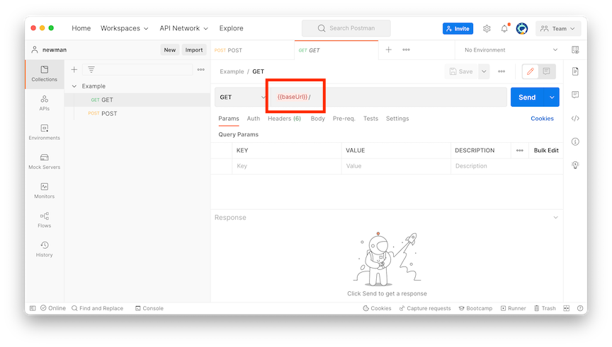

# Newman JSON Stats Reporter

A reporter for [newman], the command-line [postman] runner.

This reporter prints detailed statistics as json, 
including detailed breakdowns of timings 
like you get from the `cli` reporter. This includes dns lookup,
tcp and ssl handshake times, download time, and processing time.

## Getting Started 

You'll need [npm](https://docs.npmjs.com/cli/v8/configuring-npm/install).

Install [newman] and the [@tmclnk/json-stats] reporter.

```shell
npm i -g newman
npm i -g @tmclnk/newman-reporter-json-stats
```

## Command Line Usage

Once the `@tmclnk/newman-reporter-json-stats` npm module is installed, it is referenced from newman
as `@tmclnk/json-stats`.

```shell
newman run https://raw.githubusercontent.com/tmclnk/newman-reporter-json-stats/main/examples/postman_collection.json \
  --reporters @tmclnk/json-stats \
  --verbose
```

Note that the `--verbose` flag is REQUIRED.

### Variables

Use `--env-var "key=value"` to pass variables to your collection. For example, [postman_collection_env.json] uses
a `{{baseUrl}}` parameter to construct its urls.



```shell
newman run https://raw.githubusercontent.com/tmclnk/newman-reporter-json-stats/main/examples/postman_collection_env.json \
  --reporters @tmclnk/json-stats \
  --env-var "baseUrl=https://www.google.com" \
  --verbose
```

## Output

```json
[
  {
    "url": "https://www.devobsessed.com/",
    "method": "GET",
    "requestSize": 231,
    "responseSize": 19548,
    "statusCode": 200,
    "timing": {
      "start": 1661614275544,
      "requestStart": 1661614275554,
      "offset": {
        "request": 10.167584002017975,
        "socket": 13.681499987840652,
        "lookup": 15.907375007867813,
        "connect": 37.22204199433327,
        "secureConnect": 73.76374998688698,
        "response": 134.60854199528694,
        "end": 142.72445899248123,
        "done": 147.13712498545647
      },
      "phases": {
        "prepare": 10.167584002017975,
        "wait": 3.5139159858226776,
        "dns": 2.2258750200271606,
        "tcp": 21.314666986465454,
        "firstByte": 60.84479200839996,
        "download": 8.11591699719429,
        "process": 4.412665992975235,
        "total": 147.13712498545647,
        "secureHandshake": 36.54170799255371
      }
    }
  }
]
```

Units are milliseconds, bytes, or epoch milliseconds.

- `timing.offset` is milliseconds from the start of the request
- `timing.phases` is milliseconds of each phase

## Library Usage

You can use this newman and this module as a library. 
This might be useful if you want to roll a standalone app with simplified syntax
or baked-in collections.

See [example.js].

```javascript
const newman = require("newman");

newman.run(
    {
        collection: require("./postman_collection_env.json"),
        reporters: "@tmclnk/json-stats",
        envVar: [{ key: "baseUrl", value: "https://www.google.com" }],
        verbose: true, // required to get newman to generate add'l statistics
        silent: true, // don't let the reporter write to stdout
    },
    function (err, summary) {
        // your code here!
        console.log(summary.statistics);
    }
);
```

## Troubleshooting

```text
newman: could not find "@tmclnk/json-stats" reporter
ensure that the reporter is installed in the same directory as newman
please install reporter using npm
```

If you get the above error, and you installed newman using a package
manager (brew, apt, yum, chocolatey), you may need to uninstall newman and re-install
using npm.

```shell
npm i -g newman
```

## Related Links

* [@tmclnk/json-stats]
* [newman]
* [postman]

[@tmclnk/json-stats]: https://www.npmjs.com/package/@tmclnk/newman-reporter-json-stats
[postman]: https://www.postman.com/
[newman]: https://github.com/postmanlabs/newman
[postman_collection_env.json]: ./examples/postman_collection_env.json
[example.js]: ./examples/example.js
